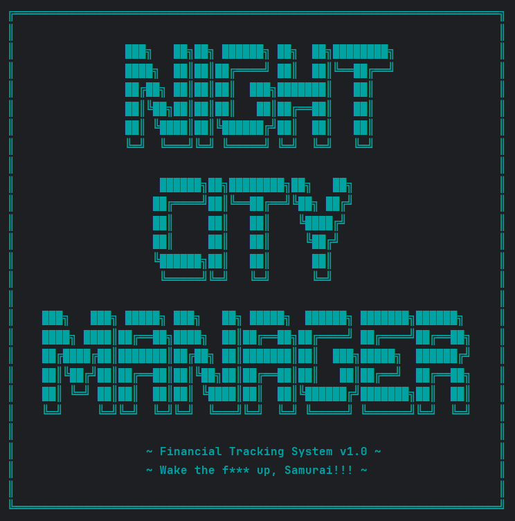
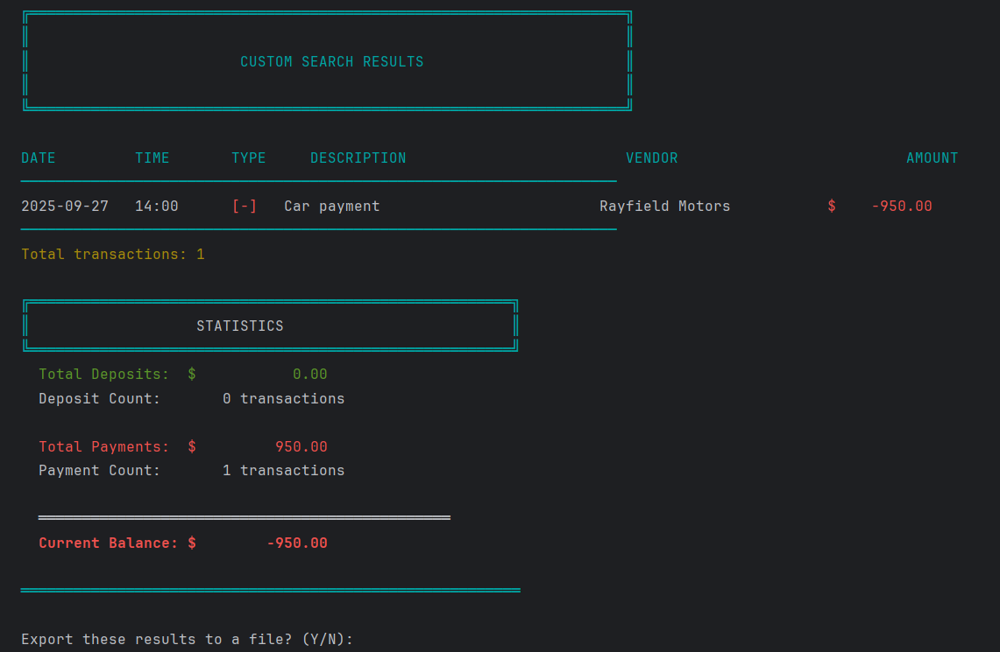

```
███╗   ██╗██╗ ██████╗ ██╗  ██╗████████╗     ██████╗██╗████████╗██╗   ██╗
████╗  ██║██║██╔════╝ ██║  ██║╚══██╔══╝    ██╔════╝██║╚══██╔══╝╚██╗ ██╔╝
██╔██╗ ██║██║██║  ███╗███████║   ██║       ██║     ██║   ██║    ╚████╔╝ 
██║╚██╗██║██║██║   ██║██╔══██║   ██║       ██║     ██║   ██║     ╚██╔╝  
██║ ╚████║██║╚██████╔╝██║  ██║   ██║       ╚██████╗██║   ██║      ██║   
╚═╝  ╚═══╝╚═╝ ╚═════╝ ╚═╝  ╚═╝   ╚═╝        ╚═════╝╚═╝   ╚═╝      ╚═╝   

███╗   ███╗ █████╗ ███╗   ██╗ █████╗  ██████╗ ███████╗██████╗ 
████╗ ████║██╔══██╗████╗  ██║██╔══██╗██╔════╝ ██╔════╝██╔══██╗
██╔████╔██║███████║██╔██╗ ██║███████║██║  ███╗█████╗  ██████╔╝
██║╚██╔╝██║██╔══██║██║╚██╗██║██╔══██║██║   ██║██╔══╝  ██╔══██╗
██║ ╚═╝ ██║██║  ██║██║ ╚████║██║  ██║╚██████╔╝███████╗██║  ██║
╚═╝     ╚═╝╚═╝  ╚═╝╚═╝  ╚═══╝╚═╝  ╚═╝ ╚═════╝ ╚══════╝╚═╝  ╚═╝
```

**>> FINANCIAL TRACKING SYSTEM v1.0**  
**>> Cyberpunk Inspired CLI Application**  
**>> Java Development Capstone Project**


---

## ┃ SYSTEM INDEX

```
[01] >> PROJECT OVERVIEW
[02] >> CORE FEATURES
[03] >> CHALLENGE IMPLEMENTATION
[04] >> VISUAL INTERFACE
[05] >> TECHNICAL STACK
[06] >> INSTALLATION PROTOCOL
[07] >> SYSTEM ARCHITECTURE
[08] >> CODE ANALYSIS
[09] >> DEVELOPMENT INSIGHTS
[10] >> FUTURE ROADMAP
[11] >> DEVELOPER PROFILE
```

---

## ┃ [01] PROJECT OVERVIEW

**Night City Manager** is a command-line financial ledger application designed to track deposits and payments with a Cyberpunk aesthetic. Built using core Java principles, this application demonstrates object-oriented programming, file I/O operations, data validation, and advanced filtering capabilities.

### >> MISSION OBJECTIVES

Track and manage financial transactions with:
- Persistent CSV-based data storage
- Multi-criteria search and filtering
- Time-based report generation
- Real-time balance calculations
- Automatic backup systems
- Data export functionality

### >> TECHNICAL DEMONSTRATION

This project showcases mastery of:
- **Object-Oriented Programming** — Eight interconnected classes with clear responsibilities
- **File I/O Operations** — Reading, writing, and backing up CSV data
- **Data Structures** — Collections framework for filtering and sorting
- **Date/Time API** — Complex date calculations and range filtering
- **Input Validation** — Defensive programming to ensure data integrity
- **CLI Design** — User-friendly terminal interface with visual feedback

---

## ┃ [02] CORE FEATURES

### >> REQUIRED FUNCTIONALITY

```
▸ TRANSACTION MANAGEMENT
  ├─ Add Deposits (Income Tracking)
  ├─ Record Payments (Expense Tracking)
  └─ CSV Persistence (Pipe-Delimited Format)

▸ LEDGER SYSTEM
  ├─ View All Transactions (Newest First)
  ├─ Filter by Deposits Only
  ├─ Filter by Payments Only
  └─ Navigate to Reports

▸ REPORTING MODULE
  ├─ Month to Date
  ├─ Previous Month
  ├─ Year to Date
  ├─ Previous Year
  └─ Vendor Search
```

### >> CHALLENGE FEATURE: CUSTOM SEARCH

**Advanced Multi-Criteria Filtering**

The custom search implements optional filtering across five parameters:
- Date Range (Start/End)
- Description Keywords
- Vendor Name
- Exact Amount Matching
- AND-logic combination of all active filters

All filters are **optional** — press ENTER to skip any criterion. The system dynamically builds the result set based on provided criteria.

### >> BONUS ENHANCEMENTS

```
▸ SYSTEM ENHANCEMENTS
  ├─ Real-Time Balance Calculation
  ├─ Transaction Statistics Display
  ├─ Automatic Backup System (Timestamped)
  ├─ Export Filtered Results to CSV
  └─ Comprehensive Input Validation

▸ USER EXPERIENCE
  ├─ Default Date/Time (Current Values)
  ├─ Confirmation Prompts (Transaction Review)
  ├─ Color-Coded Output (Terminal-Dependent)
  ├─ Case-Insensitive Search
  └─ Partial Vendor Matching
```

---

## ┃ [03] CHALLENGE IMPLEMENTATION

### >> PROBLEM STATEMENT

Implement a flexible search system where users can filter by any combination of criteria. Each filter must be optional, allowing searches by:
- Only date range
- Only vendor
- Date range + vendor + description
- Any other combination

### >> ARCHITECTURAL SOLUTION

**Boolean Flag Pattern with Independent Filter Checks**

```java
// Multi-criteria filtering with optional parameters
for (Transaction t : allTransactions) {
    boolean matches = true;
    
    // Only apply filters if user provided input
    if (!startDateStr.isEmpty()) {
        LocalDate startDate = LocalDate.parse(startDateStr);
        if (t.getDate().isBefore(startDate)) {
            matches = false;
        }
    }
    
    // Additional filter checks...
    
    if (matches) {
        filtered.add(t);
    }
}
```

**Key Design Decisions:**

1. **Optional Filtering** — Each filter checks if input exists before applying
2. **Case-Insensitive Search** — `.toLowerCase()` on both sides for text matching
3. **Partial Matching** — `.contains()` instead of `.equals()` for user-friendly vendor search
4. **Floating-Point Tolerance** — Uses `Math.abs(difference) > 0.001` instead of exact equality
5. **AND Logic** — Transaction must pass ALL provided filters to be included

This implementation demonstrates understanding of:
- Boolean logic and short-circuit evaluation
- Defensive programming (empty string checks)
- Floating-point comparison best practices
- User experience design (flexibility vs. precision)

---

## ┃ [04] VISUAL INTERFACE

### >> APPLICATION SCREENSHOTS

#### ▸ WELCOME SCREEN
  

*ASCII art introduction with Cyberpunk theming*

#### ▸ MAIN MENU
  

*Primary navigation interface*

#### ▸ TRANSACTION LEDGER
  

*Complete transaction history with color coding and statistics*

#### ▸ FILTERED VIEW: DEPOSITS
  

*Income transactions with running totals*

#### ▸ REPORTS INTERFACE
  

*Time-based filtering and search options*

#### ▸ CUSTOM SEARCH
  

*Multi-criteria filtering with optional parameters*

#### ▸ STATISTICS MODULE
  

*Real-time balance calculation and transaction summaries*

---

## ┃ [05] TECHNICAL STACK

```
▸ CORE TECHNOLOGY
  └─ Java 17 (LTS)

▸ DEVELOPMENT ENVIRONMENT
  └─ IntelliJ IDEA

▸ BUILD SYSTEM
  └─ Maven

▸ DATA STORAGE
  └─ CSV (Pipe-Delimited)

▸ VERSION CONTROL
  └─ Git / GitHub

▸ JAVA APIS UTILIZED
  ├─ java.time (LocalDate, LocalTime, YearMonth)
  ├─ java.io (BufferedReader, BufferedWriter, FileReader, FileWriter)
  ├─ java.nio.file (Files, Paths, StandardCopyOption)
  ├─ java.util (Scanner, List, ArrayList, Comparator)
  └─ java.util.function (Lambda expressions)

▸ TERMINAL FEATURES
  └─ ANSI Escape Codes (Optional color support)
```

---

## ┃ [06] INSTALLATION PROTOCOL

### >> SYSTEM REQUIREMENTS

- **Java Development Kit (JDK)** — Version 17 or higher
- **Git** — For repository cloning
- **Terminal** — Command-line interface with Java support

### >> DEPLOYMENT SEQUENCE

**1. Clone Repository**
```bash
git clone https://github.com/arsicorp/night_city_manager.git
cd night_city_manager
```

**2. Compile Source Code**
```bash
javac src/main/java/*.java
```

**3. Execute Application**
```bash
java -cp src/main/java Main
```

### >> ALTERNATIVE: IntelliJ IDEA

```
1. Open IntelliJ IDEA
2. File → Open → Select project directory
3. Right-click Main.java
4. Run 'Main.main()'
```

### >> FIRST RUN BEHAVIOR

On initial execution, the application creates an empty `transactions.csv` file. Users can:
- Add transactions through the interface
- Replace with the provided sample data file

---

## ┃ [07] SYSTEM ARCHITECTURE

```
night_city_manager/
│
├── src/main/java/           << SOURCE CODE >>
│   ├── Main.java                    ║ Application entry point
│   ├── Transaction.java             ║ Transaction data model
│   ├── FileManager.java             ║ CSV operations & backups
│   ├── DisplayHelper.java           ║ UI rendering & formatting
│   ├── InputValidator.java          ║ Input validation logic
│   ├── HomeScreen.java              ║ Main menu controller
│   ├── LedgerScreen.java            ║ Ledger view controller
│   └── ReportsScreen.java           ║ Reports & search controller
│
├── data/                    << DATA STORAGE >>
│   ├── transactions.csv             ║ Primary data file
│   └── backups/                     ║ Timestamped backups
│
├── screenshots/             << DOCUMENTATION >>
│   └── *.png                        ║ Application screenshots
│
├── README.md                << PROJECT DOCUMENTATION >>
├── .gitignore               << VCS CONFIGURATION >>
└── pom.xml                  << MAVEN CONFIGURATION >>
```

### >> CLASS RESPONSIBILITIES

**Main.java**
- Application initialization
- Scanner resource management
- Top-level exception handling

**Transaction.java**
- Transaction data model
- CSV serialization/deserialization
- Helper methods (isDeposit, isPayment)

**FileManager.java**
- CSV file read/write operations
- Automatic backup creation
- Filtered data export
- File existence verification

**DisplayHelper.java**
- Terminal output formatting
- ASCII art rendering
- Color-coded messages
- Statistics visualization

**InputValidator.java**
- Date/time format validation
- Amount validation (positive/negative)
- Text field validation
- Menu choice verification

**HomeScreen.java**
- Main menu interface
- Deposit transaction workflow
- Payment transaction workflow
- Navigation routing

**LedgerScreen.java**
- Transaction display (all/deposits/payments)
- Sorting (newest first)
- Statistics calculation
- Export functionality

**ReportsScreen.java**
- Time-based filtering (MTD, YTD, etc.)
- Vendor search
- Custom multi-criteria search
- Date range calculations

---

## ┃ [08] CODE ANALYSIS

### >> FEATURED IMPLEMENTATION: CUSTOM SEARCH

One of the most technically interesting features is the custom search functionality, which demonstrates advanced filtering logic with optional parameters.

**The Challenge: Multi-Criteria Filtering**

Users can search by any combination of criteria — start date, end date, description, vendor, and amount. The challenge is handling optional filters where users can skip any field by pressing ENTER.

**My First Attempt (That Didn't Work):**

At first, I tried building different search methods for each combination. Like `searchByVendorAndDate()`, `searchByVendorOnly()`, etc. After writing like three of these, I realized I'd need dozens of methods. There had to be a better way.

**The Solution I Landed On:**

I use one loop that checks all filters, but only applies them if the user actually provided that filter. Here's the key code:

```java
for (Transaction t : allTransactions) {
    boolean matches = true;
    
    // Check start date filter (only if user provided one)
    if (!startDateStr.isEmpty()) {
        LocalDate startDate = LocalDate.parse(startDateStr);
        if (t.getDate().isBefore(startDate)) {
            matches = false;
        }
    }
    
    // Check end date filter
    if (!endDateStr.isEmpty()) {
        LocalDate endDate = LocalDate.parse(endDateStr);
        if (t.getDate().isAfter(endDate)) {
            matches = false;
        }
    }
    
    // Check description filter (case-insensitive, partial match)
    if (!descriptionFilter.isEmpty()) {
        if (!t.getDescription().toLowerCase().contains(descriptionFilter.toLowerCase())) {
            matches = false;
        }
    }
    
    // Check vendor filter (case-insensitive, partial match)
    if (!vendorFilter.isEmpty()) {
        if (!t.getVendor().toLowerCase().contains(vendorFilter.toLowerCase())) {
            matches = false;
        }
    }
    
    // Check amount filter (exact match with tolerance for floating point)
    if (!amountStr.isEmpty()) {
        double searchAmount = Double.parseDouble(amountStr);
        if (Math.abs(t.getAmount() - searchAmount) > 0.001) {
            matches = false;
        }
    }
    
    // If all filters passed, add to results
    if (matches) {
        filtered.add(t);
    }
}
```

**A Tricky Detail:**

I also had to be careful with the amount comparison. At first I did `if (t.getAmount() == searchAmount)` but that didn't work right because of how Java handles decimal numbers. After some research, I learned to use:

```java
if (Math.abs(t.getAmount() - searchAmount) > 0.001) {
    matches = false;
}
```

This checks if the numbers are "close enough" instead of exactly equal. Problem solved!

**Why I Like This Solution:**
- It's flexible — all filters are optional
- It's maintainable — adding a new filter is easy
- It implements AND logic naturally (all provided filters must match)
- One method handles all combinations

This was definitely a "figuring it out as I go" moment, but I'm proud of the result!

---

## ┃ [09] DEVELOPMENT INSIGHTS

### >> TECHNICAL SKILLS ACQUIRED

**File I/O Finally Makes Sense**

Before this project, file operations were kind of abstract to me. Now I've read and written CSV files so many times that I actually understand what's happening. I also learned about try-with-resources (that fancy `try (FileReader reader = ...)` syntax) which automatically closes files for you. Pretty cool!

**Dates Are Way More Complicated Than I Thought**

Calculating "previous month" sounds simple until you realize months have different lengths. My first attempt just subtracted 30 days, which obviously breaks for January going back to December (31 days!). I eventually found the `YearMonth` class which handles all this complexity. Honestly, this took me like half a day to figure out and I felt really dumb, but now I know!

**Input Validation Is Annoying But Necessary**

I learned this the hard way. My app kept crashing during testing because I'd type weird stuff like "abc" for an amount or a date in the wrong format. So I had to go back and add validation for EVERYTHING. It was tedious to write, but now I get why professional apps validate everything.

### >> DESIGN DECISIONS

**Why Pipe-Delimited CSV?**

I originally used commas to separate values (like normal CSV), but then I realized vendor names and descriptions often have commas in them ("Dinner at Tom's Diner, Night City"). That broke my CSV parsing. Switching to pipes (|) fixed it.

**Why Separate Classes for Each Screen?**

My initial version had all the code in Main.java. It was like 500 lines and impossible to navigate. My instructor suggested organizing it better, so I split it into separate classes. Now when I need to fix something in the Reports screen, I only look at ReportsScreen.java. Makes way more sense!

### >> MISTAKES I MADE (AND FIXED)

**Forgot About Edge Cases**

What happens if the CSV file doesn't exist? What if it's empty? What if someone enters a date in the future? I didn't think about any of this at first. Then during testing, stuff broke. So I added error handling and validation throughout.

**Overthinking the Sorting**

I spent way too long trying to write my own sorting algorithm for the "newest first" requirement. Then I learned about `Comparator` and `Collections.sort()` and realized Java can do this in like 3 lines. Lesson learned: check if Java already has a solution before writing your own!

### >> THINGS I'M STILL WORKING ON

**Making Code More "DRY"**

I noticed I have some repeated code in a few places. Like the date validation logic appears in multiple methods. I know this goes against the "Don't Repeat Yourself" principle, but by the time I noticed, I didn't want to refactor everything. Next project, I'll plan better for reusable code.

**Better Error Messages**

Some of my error messages are pretty generic. Like "Invalid input!" isn't very helpful. Better would be "Invalid date format. Please use yyyy-MM-dd (example: 2025-10-15)". I did this for some validations but not all.

Overall though, I learned way more from this project than I expected. Having to actually BUILD something with all these concepts made them stick in a way that just doing exercises never did.

---

## ┃ [10] FUTURE ROADMAP

### >> POTENTIAL ENHANCEMENTS

**Transaction Categories**

Right now everything is just "deposit" or "payment," but it would be cool to tag things as "Food," "Rent," "Entertainment," etc. Then you could see how much you're spending on different categories.

**Budget Tracking**

It would be neat if the app could warn you when you're spending too much in a category. Like "Hey, you've already spent $500 on food this month!"

**Graphs**

I know this is a CLI app, but I wonder if I could make ASCII bar charts? That would be a fun challenge.

**Recurring Transactions**

Automatically add regular bills or income sources each month. Would save time for things like rent or salary.

**Multiple Accounts**

Track checking, savings, and credit card accounts separately with the ability to transfer between them.

**Transaction Editing**

Right now you can't modify or delete transactions after saving. Adding this would require careful implementation to maintain data integrity.

**Data Encryption**

Password protection and encrypted storage for sensitive financial data.

Some of these might be too complicated for me right now, but maybe in a few months!

---

## ┃ [11] DEVELOPER PROFILE

**[Arslan]**   
Capstone Project — Java Fundamentals  
Presentation Date: [10/17/2025]

### >> CONNECT

- **LinkedIn:** [](https://www.linkedin.com/in/arslan-durdykov-920318335)
- **GitHub:** [@arsicorp](https://github.com/arsicorp)
- **Email:** blank for now

---

## ┃ ACKNOWLEDGMENTS

**Instructors** — For teaching Java fundamentals and providing project guidance  
**Cyberpunk 2077 / CD Projekt Red** — For the inspiration and aesthetic that influenced this project's theme  
**Open Source Community** — For documentation and resources that aided development

---

## ┃ LICENSE

This project was created as an educational assignment for Java Development program. Code may be used for learning purposes.

---

```
▓▓▓▓▓▓▓▓▓▓▓▓▓▓▓▓▓▓▓▓▓▓▓▓▓▓▓▓▓▓▓▓▓▓▓▓▓▓▓▓▓▓▓▓▓▓▓▓▓▓▓▓▓▓▓▓▓▓▓▓▓▓▓▓▓▓▓▓▓▓▓▓▓▓

>> "Wake the f*** up, Samurai. We have transactions to track."

                      — Night City Manager v1.0

▓▓▓▓▓▓▓▓▓▓▓▓▓▓▓▓▓▓▓▓▓▓▓▓▓▓▓▓▓▓▓▓▓▓▓▓▓▓▓▓▓▓▓▓▓▓▓▓▓▓▓▓▓▓▓▓▓▓▓▓▓▓▓▓▓▓▓▓▓▓▓▓▓▓
```